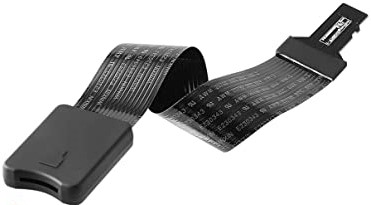
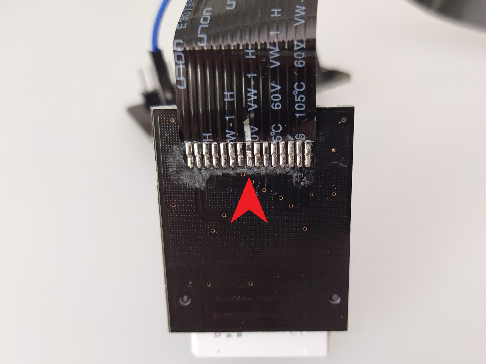
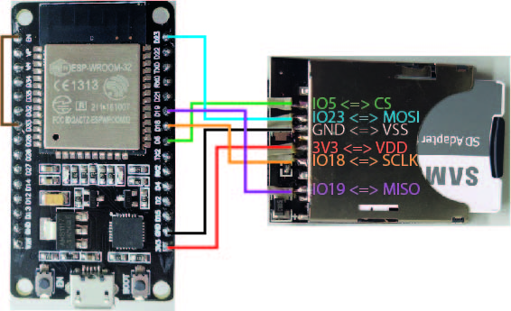
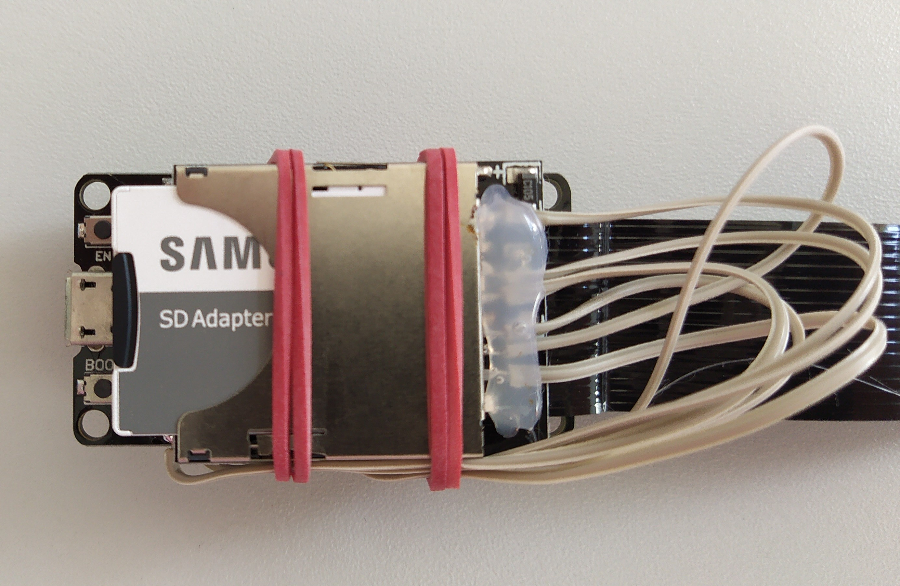
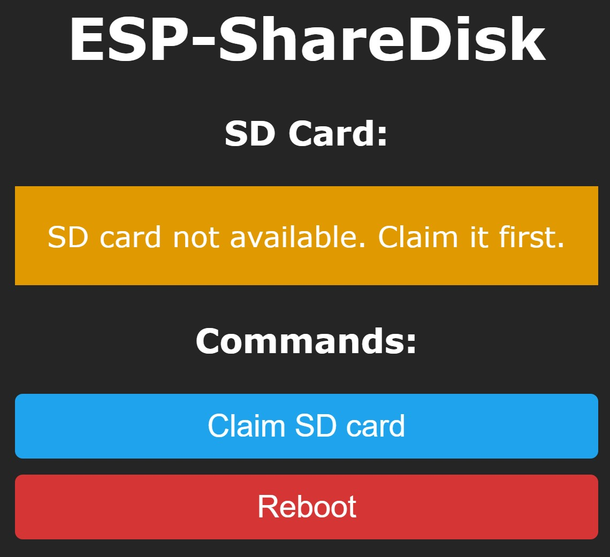
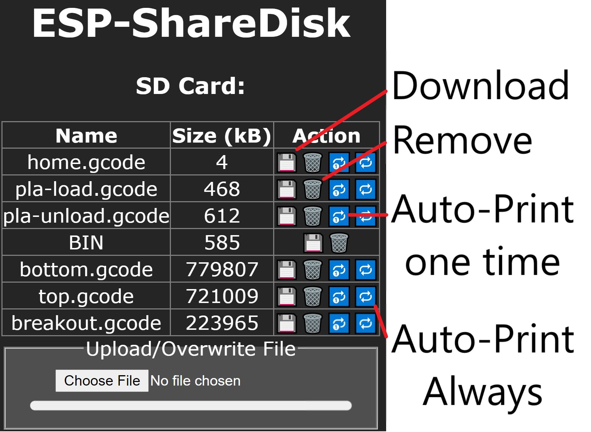

# Abstract
This project enables you to share one (micro) SD card between two devices without using a hardware multiplexer. Instead, a micro SD card adapter cable will be used while the SD card slot is also hooked on the SPI interface of an ESP32 Devkit board. Implementing a minimalistic web interface on the ESP32, the SD card can be accessed pseudo-simultanuously either via the cable or via WiFi. This setup has been tested to add the desired "WiFi capability" to a Creality Ender 3 3D printer.

# YAGNI
It is as simple as that: I just wanted to remotely load the 3D printer's SD card with my gcodes so that I just have to turn on my printer and start printing. This problem has already been solved. Here I explain why those solutions do not fit to my needs.

## [Octoprint / Octopi](https://octoprint.org/)
Octoprint (Octopi as a Raspberry Pi distribution) is heavily beloved by the maker community. This software is a huge piece of software and it is very handy and useful. Hovewer, printing from Octoprint or Uploading to the printer's SD card remains on a serial connection between the printer and the Raspberry Pi. Even with a shielded USB cable I had sporadic hardware failures showing up as `"ch341-uart ttyUSB0: usb_serial_generic_read_bulk_callback - urb stopped: -32"` in the kernel logs. This is not a problem with Octoprint but with the Raspi or with the printer. I got tired of finding a solution. 

Also, relying on a serial connection for printing just feels like stepping on the gas and on the brakes in the same time because the serial speed is the bottleneck in this game. Reading and executing the print instructions directly from SD card is just faster than running commands and all the overhead associated with through a serial connection, even when you increase baud speed. There are several threads around confirming better print quality when you print from SD card ([e.g. in this post](https://community.octoprint.org/t/ouch-sd-card-vs-octoprint-what-a-difference-help/)). And finally I am just not interested in the nozzle or bed temperature during print, nor do I monitor the printer's progress. The only thing I want is to be notified when the print has finished. This is achieved by monitoring the printer's power consumption through a tasmota enabled intelligent power supply plug and a telegram messenger.

## [Klipper](https://www.klipper3d.org/)
Klipper offloads the conversion from gcode to motor movements to an external computer like the Raspberry Pi. This is smart and it has reported to improve print speeds and quality. Nevertheless, the whole technology relies on a stable serial connection in which I don't have much trust since i saw the errors in the kernel logs.

## Toshiba FlashAir
This was the first product that I thought will fulfill my needs. Unfortunately this WiFi-SD-card is discontinuoued. The FlashAirs left are extremely expensive - of course. There are similar products out there but the embedded webservers don't seem to provide upload capabilities. Only download from SD to your end device. Also, according to [this issue](https://github.com/Creality3DPrinting/Ender-3/issues/12), the supply voltage for the SD card is hooked to the Ender's serial chip reference voltage output which may not provide enough current for all (and especially WiFi capable) SD cards.

## [SDWire](https://wiki.tizen.org/SDWire) / SD card switcher
SDWire is quite a nice open source project for switching memory between two devices via USB. 

A similar approach can also be found [here](http://www.joelfernandes.org/linuxinternals/2014/06/04/a-microsd-card-remote-switcher.html). 

Unfortunately there were no boards available.

I also tried to switch the 8 micro SD lines via a relay board between the Ender 3 and a Hama SD card reader, which then was connected to one of the Raspberry's USB ports. This indeed worked quite stable. However, "inserting" the SD card in the Ender 3 or the Pi involved too many wiring and switching and USB port power toggling for my taste. I wanted something more compact. 

# What you need
Minor soldering skills and a good soldering iron.

## Micro SD card to TF adapter cable

Open the slot-end and disrupt the power supply coming from the plug-end. You can do that with a small knife and ripping up the highlighted pad.

The SD card will receive its power from the ESP32 board.

## ESP32 Devkit or similar
Hook the wires accordingly on your ESP32 board.

You don't necessarily need to solder the wires on the ESP board. I did to ensure the connectivity and safe space. Also, if you have unwanted behavior from the SD card this is may due to reflections on the cable. Adding 22Ohm resistors to the data lines could help.

## Add reset line
Don't forget to wire the EN line of the ESP32 with the IO pin 33 (it can also be another pin, but this would mean changing a field in the code). Why? The ESP32 can be reset via software (`esp_restart()`). However, when the SPI bus claimed the SD card, this "software reset" did not properly release it. Also manual releasing and uninitializing the SPI bus before `esp_restart()` did not help. Only "pushing" the EN button or disrupting power  releases the SD card so that the ender can use it.

## Add some glue
You may pack the whole thing so that the cables won't break on the first touch. I intend to create a small housing for the whole thing.

## Upload firmware
A filesystem image containing static files served by the webserver has to be created and uploaded as well as the firmware itself. 

The project is based on Platformio and the Arduino framework. Rename `src/secrets.hpp.template` to `src/secrets.hpp` and complete your WiFi credentials in that file. Then run `build.sh` in the project root.

## Optional: [Tasmota](https://github.com/arendst/Tasmota) intelligent plug
As long as a consumer devices has claimed the SD card it won't respond to an other device. Rebooting the claiming device properly releases the SD card for sure. Therefore, if you access the sd card via the ESP-ShareDisk, ensure the 3D printer is turned off and vice versa. Yes, this is no simultanuous share between two devices, I know. However, when you use an intelligent power supply switch, you don't need to turn on and off your printer manually. This setup has been tested with [Tasmota firmware](https://github.com/arendst/Tasmota) on a Gosund SP112 plug (as the USB ports can power the ESP32). With this setup  you can switch your printer on and off remotely via REST-call or webinterface.

Note: The plug can also monitor the printer's power cosumption and act as MQTT sattelite. Let a telegram bot send you a message when power consumption falls under 4 Watts for 2 minutes ;-) 

# Usage
Be patient! This is an ESP32 board housing a webserver. This is not the fastest connection you ever experienced. Especially Upload/Download/Autoprint actions will take time. This is also because the SD card is hooked to the SPI interface, SDIO maybe faster. But for now I leave it the way it is.

1) Connect the micro USB port to a power source (USB port, USB power supply, ...)
2) Turn off your printer
3) Browse the ESP-ShareDisk landing page (default is http://espsharedisk/)(The design is inspired by the Tasmota firmware ;-))

4) Hit "Claim SD card"
5) Upload/Access* your file over the webinterface
6) Hit "Reboot" when you are done
7) Turn on printer and start printing.

*You can upload files, download and delete files and mark them for "Autoprint". On autoprint, the content of the file will be copied to `auto0.g` (give it some time, 4MB takes approximately 2 minutes) which the printer will automatically execute on startup. If you wish to print that file only once, click "Autoprint once". The `auto0.g` file deletes itself when the job is done.

